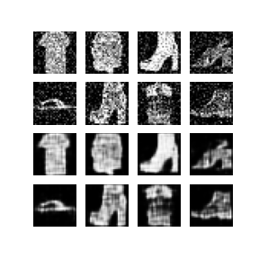

# Denoising AutoEncoder
A project to perform denoising opertaions on the images using Autoencoders. All the implementations is done using tensorflow and keras. 



In above image first two rows renders the noisy images and last two rows same images but reconstructed by model

### Requirements
- tensorflow >= 2.2
- matplotlib
- PIL

### Steps to run the project
```python
python3 autoencoder.py
```

### Commands to download dataset
```
wget https://gitlab.com/sanidhyamangal/datasets/-/raw/master/fashion-mnist_train.csv
wget https://gitlab.com/sanidhyamangal/datasets/-/raw/master/fashion-mnist_test.csv
```
